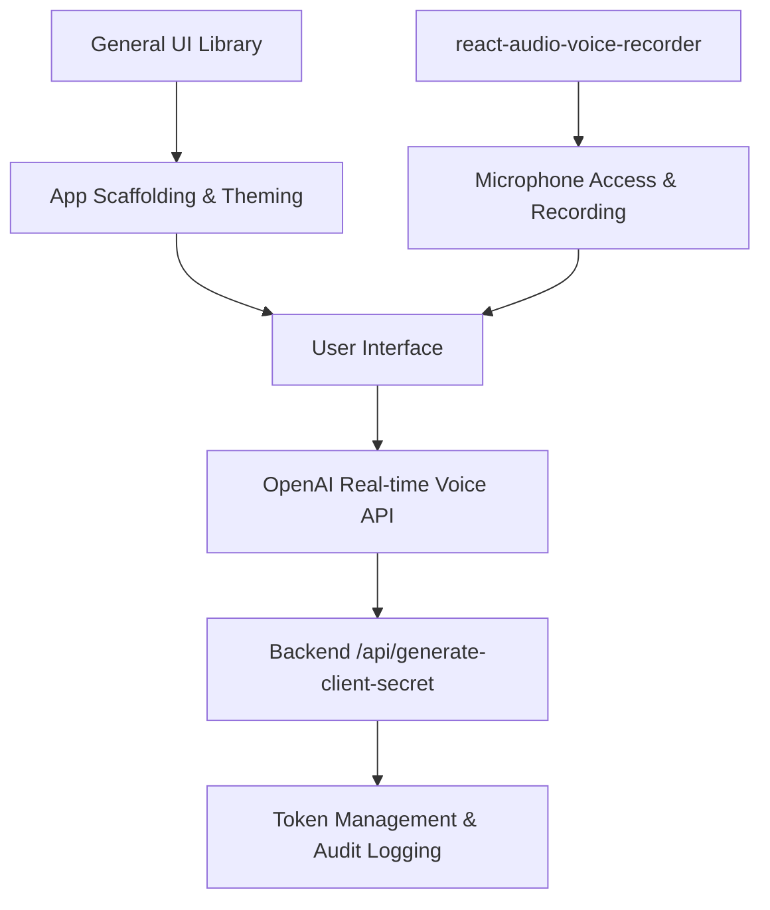

# Research Session

## Initial Query

**Question:** best React component libraries 2025 for voice apps microphone controls what developers actually use

**Response:**

## Overview of React Component Libraries for Voice Apps and Microphone Controls (2025)

Building a voice-enabled React application—especially one that interfaces with OpenAI’s real-time voice APIs—requires a robust frontend foundation. While most popular React UI libraries (Material UI, Chakra UI, Ant Design, Shadcn UI, Mantine, etc.) provide general-purpose components and excellent accessibility, **none directly specialize in voice UI or microphone controls**[1][3][4]. Instead, developers typically combine a general UI library for the app’s look and feel with a specialized audio/voice library for microphone access, recording, and advanced audio features.

Below is a comprehensive, actionable analysis of the ecosystem, best practices, and integration strategies—tailored to your project’s context and tasks.

---

## General-Purpose React UI Libraries in 2025

The leading React UI libraries in 2025 remain **Material UI**, **Chakra UI**, **Ant Design**, **Shadcn UI**, **Mantine**, and **Radix UI** (often paired with Tailwind CSS)[1][3][4]. These libraries excel at providing accessible, customizable, and responsive components for building modern web interfaces. They are widely adopted in production and offer strong community support, theme systems, and developer tooling.

- **Material UI**: Continues to lead with AI-assisted theming, advanced accessibility (ARIA), and real-time collaboration features. Its component richness and theming flexibility make it a solid base for any React app, including those with voice features[1].
- **Chakra UI**: Known for its developer experience, composable components, and built-in dark mode. Its focus on accessibility and modularity is beneficial for voice apps, where user experience and inclusivity are critical[1].
- **Shadcn UI**: Gaining traction for its open-source, copy-paste component model (not just npm modules), allowing deep customization. It’s built on Radix UI and Tailwind CSS, offering a modern, accessible foundation[3].
- **Mantine**: Offers 100+ responsive components and 50+ React hooks, making it easy to build complex UIs. Its hooks can be particularly useful for managing audio state and side effects[3].
- **Radix UI + Tailwind**: Provides unstyled, accessible primitives that can be styled with Tailwind CSS. This combo is ideal for teams wanting full design control while leveraging accessibility best practices[1].

**None of these libraries provide built-in microphone controls or voice-specific components.** They are, however, excellent for building the surrounding UI—buttons, modals, status indicators, and settings panels—that your voice app will need.

---

## Specialized Libraries for Microphone and Voice Controls

For actual microphone access, recording, and advanced audio features, **React developers typically reach for specialized libraries**. Based on your project’s Task 20, you are already planning to use **react-audio-voice-recorder**. This is a strong choice, as it abstracts the complexity of the Web Audio API and MediaRecorder, providing a React component and hook for professional-grade audio recording, including features like noise suppression and echo cancellation.

### Why react-audio-voice-recorder?

- **Abstraction**: Handles the intricacies of `getUserMedia`, `MediaRecorder`, and audio processing, letting you focus on UX.
- **Features**: Supports advanced controls like noise suppression, echo cancellation, and waveform visualization—critical for high-quality voice interactions.
- **Integration**: Easily replaces custom audio code, as noted in your Task 20, reducing maintenance burden and potential bugs.
- **Customization**: Since it’s a React component, it can be styled and composed within any UI library (Material UI, Chakra UI, etc.).

**Example Integration**  
Here’s how you might integrate `react-audio-voice-recorder` with, say, Material UI:

```jsx
import { AudioRecorder } from 'react-audio-voice-recorder';
import { Button, Card } from '@mui/material';

function VoiceRecorderPanel() {
  return (
    <Card>
      <AudioRecorder 
        onRecordingComplete={(blob) => console.log(blob)}
        showVisualizer={true}
      />
      <Button variant="contained" onClick={/* handle submit */}>
        Send Recording
      </Button>
    </Card>
  );
}
```

This pattern lets you leverage Material UI for styling and layout while using `react-audio-voice-recorder` for the actual microphone interaction.

---

## What Do Developers Actually Use?

**In production voice apps, the dominant pattern is:**

- **General UI Library**: For app scaffolding, theming, and non-audio components (Material UI, Chakra UI, etc.)[1][3][4].
- **Specialized Audio Library**: For microphone access and recording (react-audio-voice-recorder, react-media-recorder, or custom hooks based on the Web Audio API).
- **State Management**: For managing audio state, transcripts, and voice session status (React context, Redux, Zustand, etc.).
- **Accessibility**: All major UI libraries now prioritize ARIA and keyboard navigation, which is essential for voice apps used by diverse audiences.

**Less common, but worth noting:**  
Some teams build custom microphone components using the browser’s `getUserMedia` and `MediaRecorder` APIs directly, especially if they need very low-level control or have unique requirements not met by existing libraries. However, this increases maintenance overhead and risk of browser compatibility issues.

---

## Edge Cases and Potential Pitfalls

- **Browser Compatibility**: Not all browsers support all Web Audio API features equally. Test on your target platforms (Chrome, Firefox, Safari, Edge) and consider polyfills or fallbacks.
- **Permissions**: Microphone access requires user consent. Handle permission denied states gracefully in your UI.
- **Performance**: Audio processing can be CPU-intensive. Profile your app, especially on lower-end devices.
- **Error Handling**: Network issues, OpenAI API downtime, and audio device failures should all be caught and communicated to the user.
- **State Sync**: Ensure that mute/unmute (Task 18) and session state (Task 17) are correctly reflected in both the UI and the audio layer.
- **Security**: Never log raw audio data. Follow your project’s guidelines for sensitive data handling (refer to Task 2’s logging practices).

---

## Recommendations for Your Project

- **Proceed with react-audio-voice-recorder** as planned in Task 20. It’s a modern, well-maintained choice that abstracts away the hardest parts of audio recording in the browser.
- **Pair it with your preferred general UI library** (Material UI, Chakra UI, Shadcn UI, etc.) for the rest of your app’s interface. This gives you a professional, accessible, and themeable UI with minimal friction.
- **Centralize audio state management** using React context or your state library of choice. This ensures that mute/unmute, recording status, and errors are consistently reflected across components.
- **Invest in comprehensive testing** (as outlined in your test strategies) for both the UI and audio layers. Manual testing is especially important for voice features, as automated tests may not catch all audio device or permission edge cases.
- **Document your audio stack** thoroughly, including browser support matrices and error handling procedures. This will pay dividends during maintenance and onboarding.

---

## Example: End-to-End Voice App Architecture



- **E** is your React frontend, composed of general UI components and the audio recorder.
- **D** handles all microphone interactions, emitting audio blobs to **E**.
- **E** sends audio to **F** (OpenAI), which may involve your backend for secret generation and token management (**G**, **H**).

---

## Conclusion

For voice apps with microphone controls in 2025, **combine a leading React UI library for your app’s interface with a specialized audio library like react-audio-voice-recorder for microphone features**. This approach is what most production teams actually use, balancing developer experience, customization, and reliability. Your project’s existing plan aligns with industry best practices—proceed with confidence, but invest in testing and documentation to handle the unique challenges of real-time voice applications.


---

*Generated by Task Master Research Command*  
*Timestamp: 2025-09-16T22:18:14.364Z*
